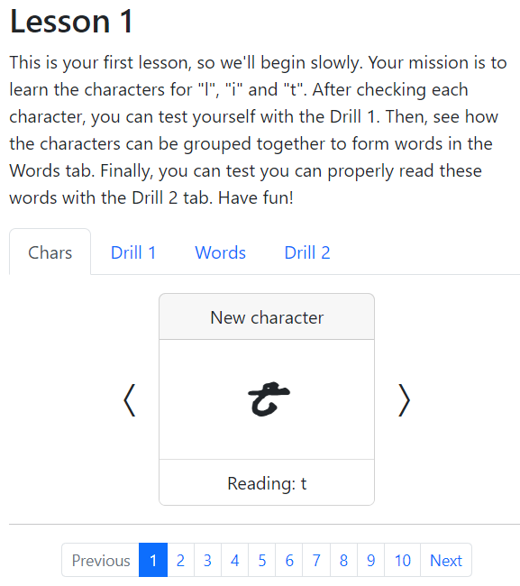

<a name="readme-top"></a>

<!-- PROJECT SHIELDS -->
[![MIT License][license-shield]][license-url]
[![LinkedIn][linkedin-shield]][linkedin-url]

<!-- TITLE -->
<br />
<div align="center">
  <h3 align="center">Emblem Translations</h3>
    <a href="https://emblem-translations.vercel.app/">
        
    </a>
  <p align="center">
    Japanese to English Translations for a global Fire Emblem Community
    <br />
    <a href="https://emblem-translations.vercel.app/">View Live Demo</a>
  </p>
</div>

<!-- ABOUT THE PROJECT -->
## About the Project

[![Emblem Translations Screenshot][project-screenshot]](https://emblem-translations.vercel.app/)

This project aims to provide free access to translation of various books, magazines, articles or other Fire Emblem-related materials from Japanese into English.

With it, you can:
* read text published exclusively in Japanese, but translated into English
* compare the text in both languages, if you study Japanese or translation in general

BONUS: learn the Ancient Tellius Language with drills and vocabulary in the `Tellius Ancient Language` section.

<a href="https://emblem-translations.vercel.app/ancient">
  
</a>

<p align="right">(<a href="#readme-top">back to top</a>)</p>

### Built with

This website has been created with:
* [![React][React.js]][React-url]
* [![ReactRouter][ReactRouter]][ReactRouter-url]
* [![Bootstrap][Bootstrap.com]][Bootstrap-url]

<p align="right">(<a href="#readme-top">back to top</a>)</p>

<!-- GETTING STARTED -->
## Getting Started

To get a local copy up and running follow these simple example steps.

### Installation

1. Clone the repo
```sh
git clone https://github.com/ChristianPerrotta/EmblemTranslations.git
```

2. Install NPM packages
```sh
npm install
```
3. Run the vite project
```sh
npm start
```
<p align="right">(<a href="#readme-top">back to top</a>)</p>

<!-- LICENSE -->
## License

Distributed under the MIT License. See `LICENSE.txt` for more information.

<p align="right">(<a href="#readme-top">back to top</a>)</p>

<!-- CONTACT -->
## Contact

Christian Perrotta - chr.perrotta@gmail.com

Project Link: [https://github.com/ChristianPerrotta/EmblemTranslations](https://github.com/ChristianPerrotta/EmblemTranslations)

<p align="right">(<a href="#readme-top">back to top</a>)</p>

<!-- MARKDOWN LINKS & IMAGES -->
[license-shield]: https://img.shields.io/github/license/othneildrew/Best-README-Template.svg?style=for-the-badge
[license-url]: https://github.com/ChristianPerrotta/adparnassum/blob/main/LICENSE.txt
[linkedin-shield]: https://img.shields.io/badge/-LinkedIn-black.svg?style=for-the-badge&logo=linkedin&colorB=555
[linkedin-url]: https://www.linkedin.com/in/christian-perrotta-17422b114/
[project-screenshot]: src/assets/screenshot.png
[React.js]: https://img.shields.io/badge/React-20232A?style=for-the-badge&logo=react&logoColor=61DAFB
[React-url]: https://reactjs.org/
[Bootstrap.com]: https://img.shields.io/badge/Bootstrap-563D7C?style=for-the-badge&logo=bootstrap&logoColor=white
[Bootstrap-url]: https://getbootstrap.com
[ReactRouter]: https://img.shields.io/badge/React_Router-CA4245?style=for-the-badge&logo=react-router&logoColor=white
[ReactRouter-url]: https://reactrouter.com/en/main